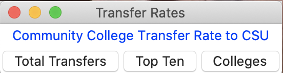
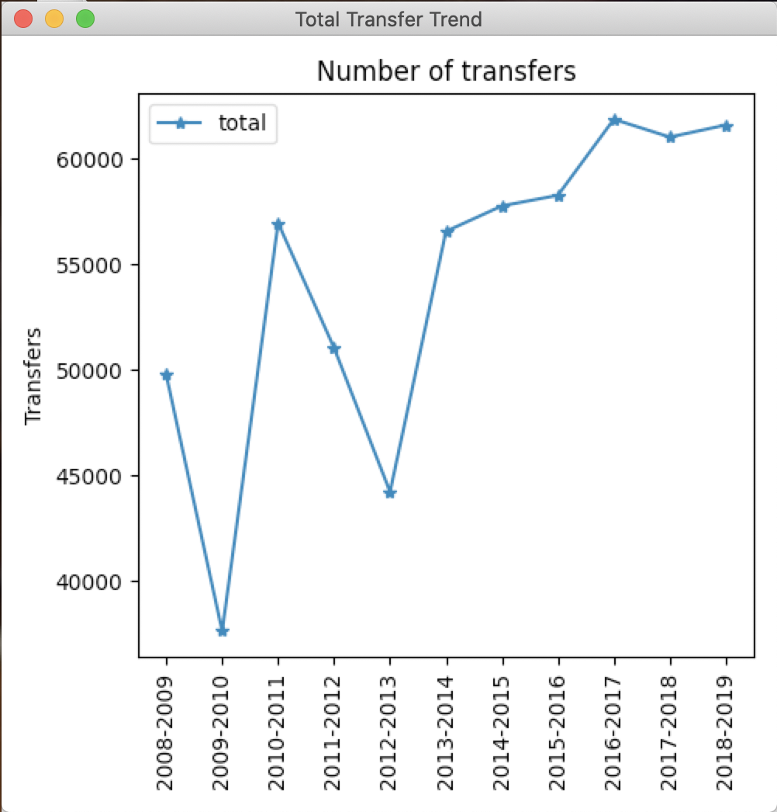
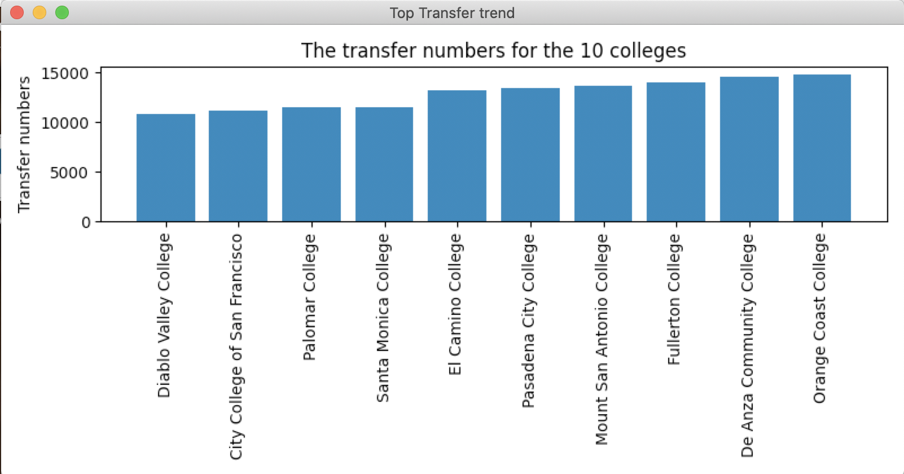
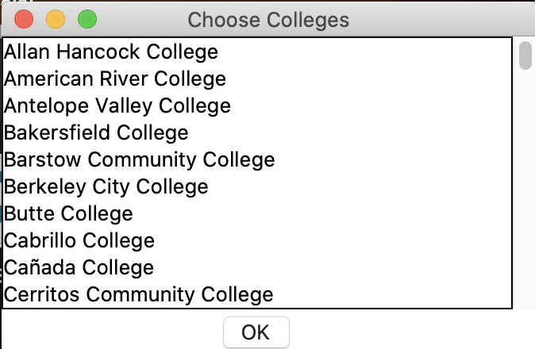
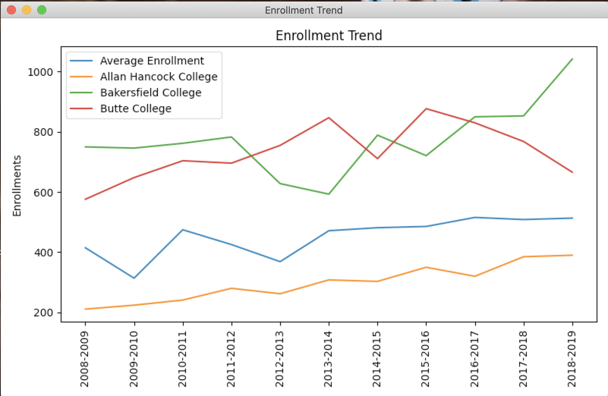

# Community College Trasfer Rate Summary

A GUI application that lets the user look up the transfer rate of CA community colleges to the CSUs.

### Total Transfer

Display the line graph of the transfer trend during 2008-2019  

### Top Ten

Dispaky the Bar chart of the top 10 CC with the heighest transfer rate

### Comparing All CCs

- User can choose colleges to compare in the listbox
  
- The Result will be displayed in line graph
  
